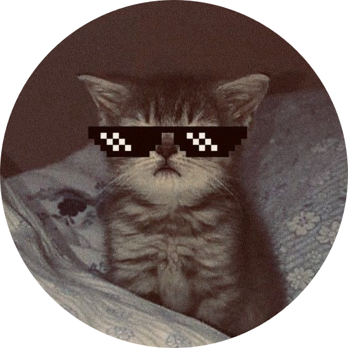

  

 

  

<h2 align="center">⚡ Full Stack Web Developer · Engineer ⚡</h2>

  

  Hey there! I'm a final-year <b>Computer Science & Engineering</b> student obsessed with crafting sleek, interactive, and scalable web applications using the <b>MERN Stack</b> and <b>Tailwind CSS</b>. 
  Always experimenting with modern UI/UX aesthetics, building real-world full-stack tools, and participating in hackathons!

  
  
  

 

  

## 🌌 Quick Orbit

- 🎓 **Current Status:** Final-year B.Tech CSE student at **Rayat Bahra Professional University** *(Aug 2023 – Present)*.
- ⚡ **Core Arsenal:** Specializing in Full-Stack development *(React.js, Node.js, Express.js, MongoDB, Tailwind CSS)*.
- 🤝 **Let's Connect:** Open for software engineering roles, hackathon teams, and innovative open-source projects.

  

## 💻 Tech Stack & Tools

**Languages:** &nbsp;&nbsp;&nbsp;&nbsp;      
**Frontend:** &nbsp;&nbsp;&nbsp;&nbsp;&nbsp;&nbsp;&nbsp;      
**Backend:** &nbsp;&nbsp;&nbsp;&nbsp;&nbsp;&nbsp;&nbsp;&nbsp;     
**Databases:** &nbsp;&nbsp;&nbsp;&nbsp;    
**Tools:** &nbsp;&nbsp;&nbsp;&nbsp;&nbsp;&nbsp;&nbsp;&nbsp;&nbsp;&nbsp;&nbsp;&nbsp;&nbsp;&nbsp;     

  

## 🏆 Hackathon Wins & Achievements

| 
⚡ Event / Competition
 | 
Project & Details
 | 
Status
 | 
Year
 |
| :--- | :--- | :---: | :---: |
| **Snap Syntax**   *IIT Roorkee — Cognizance 2026* | Secured **2nd Position** in this premier competitive coding championship and won cash prizes worth **₹60,000**. |  | **2026** |
| **Zonals Snap Syntax**   *Rayat Bahra Professional University* | Secured **2nd Position** in the campus qualifiers organized by IIT Roorkee representatives; won a fully-sponsored invite to Cognizance 2026. |  | **2026** |
| **Full Stack Web Dev Hackathon**   *Rayat Bahra Professional University* | Secured **2nd Position** overall by engineering and pitching **'CityCare'**, a full-stack civic issue reporting platform. |  | **2025** |

  

## ⚡ GitHub Contributions & Streak

  

 

  

---

  <h3>Thanks for dropping by! ⚡</h3>
  <i>⭐ If you like my profile or my MERN stack projects, don’t forget to leave a star! ⭐</i>  

  

